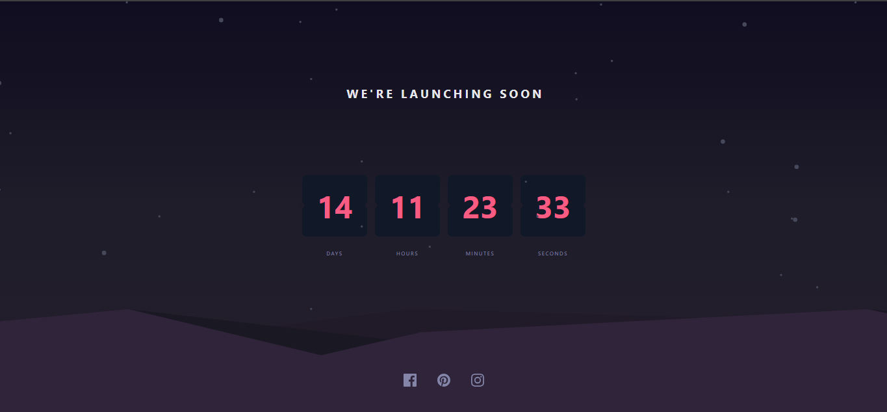

# Launch Countdown Timer ⏳



A responsive countdown timer built as part of a Frontend Mentor challenge. This timer features a dynamic countdown from 14 days with flip-card animation effects for number transitions. Designed with Tailwind CSS and built using vanilla JavaScript.

## 🚀 Overview

This project is a solution to the [Launch Countdown Timer Challenge](https://www.frontendmentor.io/challenges/launch-countdown-timer-N0XkGfyz-) on Frontend Mentor. It helped reinforce my understanding of DOM manipulation, animation, and responsive design using Tailwind CSS.

### 🧠 Key Features

- Live countdown timer that updates every second
- Flip animation when numbers change
- Fully responsive design
- Hover states for interactive elements

---

## 🔨 Built With

- Semantic HTML5
- **Tailwind CSS** for styling
- **Vanilla JavaScript** for timer logic and animation
- Flexbox for layout

---

## 📚 What I Learned

- Creating flip animations using CSS and JavaScript
- Managing time-based logic with `setInterval()` and date calculations
- Efficiently structuring and styling layouts with Tailwind CSS
- Using JavaScript to dynamically update and animate UI elements

### Sample: Padding single digits with leading zero
```js
flipCard("seconds", String(seconds).padStart(2, "0"));
```

### Sample: Flip animation class trigger
```js
topHalf.classList.add("animate-flip-top");
```

### 🔁 Continued Development
To improve future projects, I plan to:

- Explore more advanced Tailwind CSS utilities and customization

- Build more attractive and accessible UIs

- Deepen my understanding of animation timing functions and smoother transitions

---

### ✍️ Author
- Frontend Mentor: [@nishmikaeka](https://www.frontendmentor.io/profile/nishmikaeka)

 ---